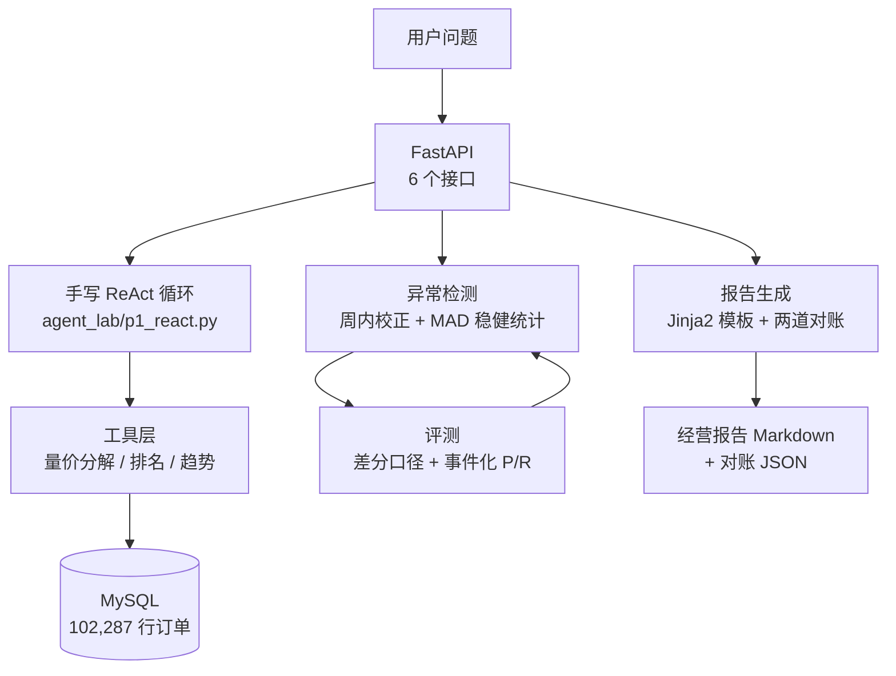
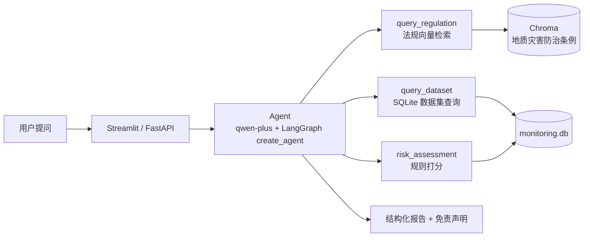

# 钟英浩 · AI 应用开发（Agent / RAG / Python）

> 遥感科班转 Agent 开发 · 2026 届 · 深圳（可随时到岗）
> GitHub：[@Emanonzzh](https://github.com/Emanonzzh) ｜ 联系方式见简历
> 求职意向：**Agent 应用开发 / Python 开发**

这个仓库是我从遥感专业转向 AI 应用开发的完整学习记录：**两个独立项目 + 全部源码 + 学习日志 + 面试准备材料**。

---

## 📁 仓库结构导览（哪部分是我的作品）

| 位置 | 内容 | 性质 |
|---|---|---|
| **`agent_lab/`** | 销售经营分析 Agent：工具层 / 异常检测 / 评测 / 报告对账 / FastAPI / Streamlit 看板 | ⭐ **项目一（作品）** |
| **`day21.py`** `day22_seed_data.py` `day23_risk.py` `api_rag.py` `Dockerfile` `deploy.sh` | 遥感监测智能助手：三工具 Agent + 一键部署 | ⭐ **项目二（作品）** |
| `rag_eval.py` `rag_eval_questions.py` | 遥感项目的检索评测（12 题 × 4 组参数对比） | ⭐ 评测证据 |
| `learning/` | 手写练习与学习过程稿（两数之和、手写 Function Calling、手写 RAG…） | 📚 学习痕迹，**非成品** |
| `docs/` | 学习路径、项目口述稿、求职材料、低配机学习指南 | 📄 文档 |
| `monitoring.db` `知识库.txt` `地质灾害防治条例.txt` `点位数据.json` `监测报告.txt` | 数据与知识库素材 | 🗂 数据 |

> **想快速看代码** → `agent_lab/代码导读.md`
> **想看踩过哪些坑** → `docs/求职/项目二_Agent学习日志.md`
> **想看评测怎么做的** → `agent_lab/eval/anomaly_report.md`

---

# 项目一：销售经营分析 Agent（真实电商数据 · 独立开发）

> 在开源企业级项目（FastAPI + MySQL + Redis + Nginx + LangGraph）基础上做**增量演进**，
> 补齐它缺失的「发现异常 → 逐维下钻 → 量价归因 → 经营报告」分析闭环。
> 数据：仓库自带 **102,287 行真实电商订单**。

## 三个可验证的硬指标（每条都能自己跑出来）

| 指标 | 结果 | 怎么复现 |
|---|---|---|
| **量价三因子分解精确加总** | 三项之和 − 总变化 = **0.0**（断言校验） | `python agent_lab/tools.py` |
| **异常检测** | 查全 **100%**（6/6 注入事件）· **无关误报 0** · F1 70.59% | `python agent_lab/inject_anomalies.py` → `python agent_lab/evaluate_anomaly.py` |
| **报告数字对账** | 文本级 88 个数字 **0 违规** · 数据库级 **11/11 复算一致 Δ=0.0** · 对账器自测通过 | `python agent_lab/report.py` |

## 架构



## 核心设计（面试重点）

- **数字由代码产生，模型不碰数值**：报告模板里只有占位符，所有数值在 Python 里算好后以字符串传入；
  LLM 只写不含数字的自然语言，且其文本仍要过一遍对账。
- **手写 ReAct 循环，不依赖框架**：自己实现多轮循环、步数上限、token 预算、
  **重复动作检测**、observation 截断、**错误回传**、每步轨迹与 token 统计。
- **错误回传**：工具报错不直接抛异常，而是作为 observation 喂回模型 → 让它**读懂错误再修正**
  （压测中模型据此成功从"数据库超时"中恢复）。
- **异常检测的四条原则**：最小支持度门槛 / **周内效应校正**（同星期几基线）/ 日历校正 / MAD 稳健统计。
- **评测方法论**：**差分口径**剔除真实业务事件的噪声地板 + **事件化后处理**
  （持续型异常天然产生「进入+内部+恢复」多个检出点）。

## 快速开始

```bash
# 前置：MySQL（orders 表 102,287 行）+ .env 配好 DB_USER/DB_PASSWORD/DB_NAME/LLM_API_KEY

python agent_lab/tools.py                 # 工具自检（不花钱）
python agent_lab/anomaly.py               # 检测器自检：对比周内校正前后的误报量
python agent_lab/inject_anomalies.py      # 造带 ground truth 的评测集
python agent_lab/evaluate_anomaly.py      # 评测 → eval/anomaly_report.md
python agent_lab/report.py                # 出经营报告 + 两道对账
python agent_lab/api.py                   # 起 FastAPI 服务
python agent_lab/api_smoke_test.py        # 7 项接口冒烟测试
python agent_lab/p1_react.py              # 手写 ReAct 跑 3 个真实问题
python agent_lab/p1_stress.py             # 6 场景故障注入压测
```

启动后打开 **http://127.0.0.1:8000/docs** 可直接点着调接口。

## 目录

| 文件 | 说明 |
|---|---|
| `agent_lab/tools.py` | 4 个纯函数工具 + KPI 口径表 + **量价三因子分解**（含加总断言） |
| `agent_lab/anomaly.py` | 异常检测：周内效应校正 + 日历校正 + MAD 稳健统计 + 脉冲/漂移两类 |
| `agent_lab/inject_anomalies.py` | 注入 6 个已知异常造评测集（副本表，不动原表） |
| `agent_lab/evaluate_anomaly.py` | 差分口径 + 事件化后处理的 P/R/F1 评测 + 门槛扫描 + 误报归因 |
| `agent_lab/report.py` | 报告生成 + **两道数字对账 + 对账器自测** |
| `agent_lab/api.py` | FastAPI 6 接口（`/health` `/metrics` `/anomalies` `/report` `/reconciliation` `/analyze`） |
| `agent_lab/api_smoke_test.py` | Python 客户端冒烟测试（7 项） |
| `agent_lab/p1_react.py` | **手写 ReAct 循环**（不依赖框架） |
| `agent_lab/p1_stress.py` | 6 场景故障注入压测 |
| `agent_lab/代码导读.md` | 读码顺序 / 关键代码片段 / 面试"讲代码"路线 / 9 个追问 |
| `agent_lab/FastAPI入门.md` | FastAPI 零基础入门（结合本项目代码） |
| `docs/求职/项目二_Agent学习日志.md` | 完整开发日志：每次踩坑与修复的真实记录 |

---

# 项目二：遥感监测智能助手（RAG + 多工具 Agent）

基于 **RAG + 多工具 Agent** 的遥感地质灾害智能问答系统：支持自然语言查询地面沉降、滑坡预警、形变风险等问题，并给出**带法规依据**的回答与**结构化风险报告**。

> **在线体验**：http://47.76.101.97:8501 （Docker 部署于阿里云 ECS / Ubuntu 22.04）

## 项目亮点

- **一个 Agent 三把刀**：法规问答（RAG）+ 数据集查询（SQLite 真实元数据）+ **形变风险评估（规则打分）**
- **数据诚实**：知识库为 gov.cn《地质灾害防治条例》（真实法规）；真实数据集注明出处；示例数据明确标注
- **风险评估不交给 LLM 瞎评**：速率/加速/异常三指标 Python 规则打分，LLM 只负责解释
- **检索评测**：自建 12 题测试集，`chunk_size`(100/400) × `k`(2/4) 四组对比，**命中率 83% → 100%**

## 架构



## 快速开始

```bash
pip install -r requirements.txt
export DASHSCOPE_API_KEY=你的密钥
streamlit run day21.py            # 三工具 Agent 网页版
python api_rag.py                 # FastAPI 接口
bash deploy.sh                    # 服务器一键部署
```

## 技术栈

Python · LangChain · LangGraph · Chroma · MySQL · SQLite · FastAPI · Streamlit · Docker · Nginx · 通义千问 qwen-plus · DeepSeek · text-embedding-v3

---

# 学习资料导航

| 文档 | 用途 |
|---|---|
| `agent_lab/代码导读.md` | 读码顺序 + 面试"讲代码"路线 |
| `agent_lab/FastAPI入门.md` | FastAPI 零基础入门 |
| `docs/求职/销售经营分析Agent_项目框架.md` | 销售项目完整框架（分层架构/双线设计/缺口） |
| `docs/求职/项目二_技术栈口述稿与内化自测.md` | 技术栈口述稿 + 30 问内化自测 |
| `docs/求职/项目二_Agent学习日志.md` | 开发日志：踩坑与修复记录 |
| `docs/求职/项目二_数据能力盘点与Phase0业务定义.md` | 数据能力盘点 + KPI 口径定义（能算什么、不能算什么） |
| `docs/求职/项目二_框架评审与企业化修正方案.md` | 对企业化 Agent 架构设计的技术评审与修正 |
| `docs/SQL练习_销售项目进阶.md` | SQL 进阶练习（绑定销售项目真实数据） |
| `docs/低配电脑学习指南.md` / `docs/白天学习时间表.md` | 在低配环境继续学习的方法 |
| `docs/项目口述稿.md` | 遥感项目口述稿（1 分钟 / 3 分钟 / Q&A） |

# 作者

遥感科学与技术背景（毕设：云贵高原湖泊 2013–2022 动态变化分析，含 6 种水体指数精度对比 + K-Means + 回归归因），
2026 届毕业生。先在遥感项目打通「RAG + Agent + Docker 上线」完整链路，再在真实电商数据上做量价归因与 Agent 机制的手写实现，
两条线都保持**"结论可验证、数据边界讲清楚"**的习惯。

目标岗位：**Agent 应用开发 / Python 开发**（深圳）。
