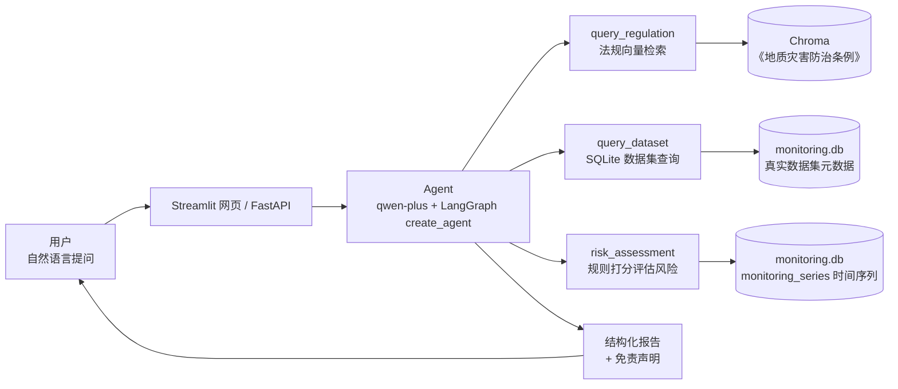

# 遥感监测智能助手（Remote Sensing AI Assistant）

基于 **RAG + 多工具 Agent** 的遥感地质灾害智能问答系统：支持自然语言查询地面沉降、滑坡预警、形变风险等监测问题，并给出**带法规依据**的回答与**结构化风险报告**。

> **在线体验**：http://47.76.101.97:8501 （Docker 部署于阿里云 ECS / Ubuntu 22.04，随时可点）
> **作者**：遥感专业背景 · AI 应用开发方向 · 求职中（GitHub: [Emanonzzh](https://github.com/Emanonzzh)）

---

## ✨ 项目亮点

- **一个 Agent 三把刀**：法规问答（RAG）+ 数据集查询（SQLite 真实元数据）+ **形变风险评估（规则打分）**
- **数据诚实**：知识库为 gov.cn《地质灾害防治条例》（真实法规）；真实数据集注明出处；示例数据明确标注"示例演示数据"
- **风险评估不交给 LLM 瞎评**：速率/加速/异常三指标 Python 规则打分（≤30 低 / ≤60 中 / >60 较高），LLM 只负责解释
- **端到端可交付**：手写 RAG → LangChain → LangGraph Agent → FastAPI → Streamlit → Docker 公网部署
- **理解底层**：先手写 Function Calling 循环与 RAG 全链路，再上框架（见下方"技术点"）

## 🖼 演示截图

<!-- TODO: 把截图放这里（例如 docs/screenshot.png），一行搞定：

-->

## 🏗 系统架构



## 💡 核心面试技术点（本仓库都能讲清楚）

1. **先手写再框架**：`rag_from_scratch.py`（切片→向量→检索→生成全手写）、`agent_function_calling.py`（手写工具调用循环）→ 理解 `create_agent`/LangGraph 背后发生了什么
2. **工具触发边界用 docstring 约束**：`risk_assessment` 明确"仅当询问某区域形变风险时调用"，避免概念题（什么是 InSAR）被误路由——工具描述就是给 LLM 的路由器
3. **规则打分 vs LLM 判断**：风险计算用确定性 Python 规则，结果可复现、可解释；LLM 只做翻译与报告生成
4. **数据诚实与防幻觉**：示例数据显式标注、真实数据可溯源；曾出现 LLM 编造数据集中不存在的"速率数字"，已作为反面案例记录

## 功能

- **RAG 知识库问答**：LangChain + Chroma，对《地质灾害防治条例》检索增强生成（带依据、可溯源）
- **多工具 Agent**：Function Calling + LangGraph，LLM 自主决策调用法规/数据集/风险评估工具
- **Web 界面**：Streamlit，输入问题回车即答，支持结构化报告展示
- **RESTful API**：FastAPI 封装，支持 URL 查询并返回引用来源

## 技术栈

Python · LangChain · LangGraph · Chroma · SQLite · FastAPI · Streamlit · Docker · 通义千问 qwen-plus · text-embedding-v3

## 项目结构

| 文件 | 说明 |
|------|------|
| `day21.py` | **成品**：三工具 Agent（法规 RAG + 数据集 SQL + 风险规则打分），Streamlit 入口 |
| `day22_seed_data.py` | V2-A1：建 `monitoring_series` 时间序列表 + 18 期示例数据（幂等） |
| `day23_risk.py` | V2-A2：`risk_assessment` 规则打分实现 |
| `rag_from_scratch.py` | 手写 RAG 全链路（理解原理用） |
| `rag_langchain.py` | LangChain 框架版 RAG |
| `agent_function_calling.py` | 手写 Function Calling 循环（理解 Agent 底层） |
| `agent_langgraph.py` | LangGraph `create_agent` 版多工具 Agent |
| `api_rag.py` | FastAPI 封装 RAG 的 RESTful API |
| `web_rag.py` / `web_agent.py` | Streamlit 网页版（RAG / 多工具 Agent） |
| `day19_sqlite.py` / `day20.py` | SQLite 建库 + SQL 封装成 Agent 工具（学习路径） |
| `Dockerfile` / `deploy.sh` | 容器化 + **一条命令部署脚本**（自动保留 API Key） |
| `知识库.txt` | RAG 使用的遥感知识文档 |
| `地质灾害防治条例.txt` | 真实法规知识库（gov.cn 来源） |
| `监测报告.txt` / `点位数据.json` | 遥感监测数据文件 |
| `面试题库_AI_Interview/` | 开源 AI 面试题库（圈定 4 个目录学习） |
| `AGENTS.md` | 学习者进度档案（每次会话必读） |

## 快速开始

```bash
# 1. 安装依赖
pip install openai chromadb langchain langchain-openai langchain-chroma langchain-text-splitters langgraph fastapi uvicorn streamlit

# 2. 配置 API Key（阿里云百炼）
export DASHSCOPE_API_KEY=你的密钥

# 3. 运行成品（Streamlit 网页）
streamlit run day21.py

# 4. 网页版 RAG / 多工具 Agent
streamlit run web_rag.py
streamlit run web_agent.py

# 5. API 服务
python api_rag.py
```

浏览器访问：`http://127.0.0.1:8501`

### API 用法示例

```bash
curl "http://127.0.0.1:8001/ask?question=什么是PS-InSAR"
```

## Docker 部署

**服务器上一条命令（推荐）**：登录服务器 → 进入项目目录 → `git pull` → `bash deploy.sh`
（脚本会自动：拉最新代码 → 构建镜像 → 从旧容器恢复 `DASHSCOPE_API_KEY` → 重启 → 健康检查）

手动部署：

```bash
docker build -t rs-assistant .
docker run -d -p 8501:8501 -e DASHSCOPE_API_KEY=你的密钥 --name rs-app rs-assistant
```

## 作者

遥感科学与技术背景（毕设：云贵高原湖泊 2013–2022 动态变化分析），2026 届毕业生，目标岗位 **AI 应用开发工程师（RAG/Agent/LLM 方向）**。本项目为独立开发作品，学习周期约 1 个月（从零基础到 Docker 上线）。
